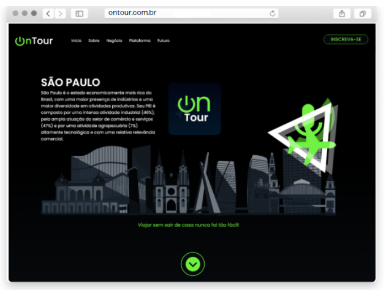

<p align="center">
  
<p>

<p align="center"> 
  
  
  <a href="https://github.com/rafaelfachinelli">
    
  </a>
  
<p>

<p align="center">
 <a href="#movie_camera-demonstração">Demonstração</a> •
 <a href="#computer-sobre">Sobre</a> •
 <a href="#hammer-tecnologias">Tecnologias</a> •
 <a href="#arrow_forward-executar">Executar</a> •
 <a href="#page_facing_up-licença">Licença</a>
</p>

---
## :movie_camera: **Demonstração**

<p align="center">
  <kbd><a href="https://rafaelfachinelli.github.io/OnTour/" target="_blank"></a></kbd>
<p>
  
---
## :computer: Sobre

Instituições como museus, hoteís, parques entre outros tiveram uma queda imensa de público causada pela pandemia, criando um défict na renda que mantém essas instituições funcionando.

Plataforma com propósito de realizar Tours Online, gratuitos ou pagos, ao vivo liderados por guias turisticos do local, com rotas e tempo definidos, podendo ser divulgado no site da instituição para seus clientes e também encontrado por entusiastas na plataforma.

---
## :hammer: **Tecnologias**

As seguintes ferramentas foram utilizadas na construção do projeto:

<div align="center">

|:computer: Web|
|:---:|
|[HTML5](https://developer.mozilla.org/pt-BR/docs/Web/HTML/HTML5)	|
|[CSS3](https://developer.mozilla.org/pt-BR/docs/Archive/CSS3)		|
|[JavaScript](https://www.ecma-international.org/publications/standards/Ecma-262.htm)|
|[React](https://reactjs.org)|
|[TypeScript](https://www.typescriptlang.org)|

</div>

---
## :arrow_forward: **Executar**

### :desktop_computer: **WEB Responsive**

Abra a pasta [`exemple/`](exemple/) e execute os seguintes comandos:

<details>
  <summary><i>com <b>npm</b></i></summary>
  
  ```bash
  # Instalar dependências
  $ npm install

  # Iniciar o servidor de desenvolvimento
  $ npm start
  ```
  
</details>

<details>
  <summary><i>com <b>yarn</b></i></summary>
  
  ```bash
  # Instalar dependências
  $ yarn

  # Iniciar o servidor de desenvolvimento
  $ yarn start

  ```

</details>

> ⚠️ O servidor de desenvolvimento vai executar na porta:3000 - Access <http://localhost:3000>

---
## :muscle: **Contribuidores**

<div align="center">

<!-- prettier-ignore-start -->
<!-- markdownlint-disable -->

<table>
  <tr>
    <td align="center">
      <a href="https://www.instagram.com/producoesgarcia_/">
        <br />
        <sub><b>Deivid Garcia</b></sub>
      </a>
      <br/>
      <a href="https://www.instagram.com/producoesgarcia_/" title="Instagram"></a>
    </td>
    <td align="center">
      <a href="https://www.linkedin.com/in/gfrancodev">
        <br />
        <sub><b>Gustavo Franco</b></sub>
      </a>
      <br/>
      <a href="https://www.linkedin.com/in/gfrancodev" title="LinkedIn"></a>
      <a href="https://github.com/gfrancodev" title="GitHub"></a>
      <a href="https://www.behance.net/gfrancodev" title="Behance"></a>
      <a href="https://www.instagram.com/gfrancodev" title="Instagram"></a>
    </td>
    <td align="center">
      <a href="https://github.com/rafaelfachinelli">
        <br />
        <sub><b>Rafael Fachinelli</b></sub>
      </a>
      <br/>
      <a href="https://www.linkedin.com/in/rafaelfachinelli" title="LinkedIn"></a>
      <a href="https://github.com/rafaelfachinelli" title="GitHub"></a>
    </td>
    <td align="center">
      <a href="https://www.linkedin.com/in/thaina-monteiro">
        <br />
        <sub><b>Thainá Monteiro</b></sub>
      </a>
      <br/>
      <a href="https://www.linkedin.com/in/thaina-monteiro" title="LinkedIn"></a>
      <a href="https://github.com/thainamonteiro" title="GitHub"></a>
      <a href="https://www.instagram.com/mont_thaina/" title="Instagram"></a>
    </td>
  </tr>
</table>

<!-- markdownlint-restore -->
<!-- prettier-ignore-end -->

</div>

---
## :page_facing_up: **Licença**

<div align="center">

Copyright © 2020 [OnTour](https://rafaelfachinelli.github.io/OnTour/).<br />
Este projeto é licenciado pelo [MIT](./LICENSE).

</div>
